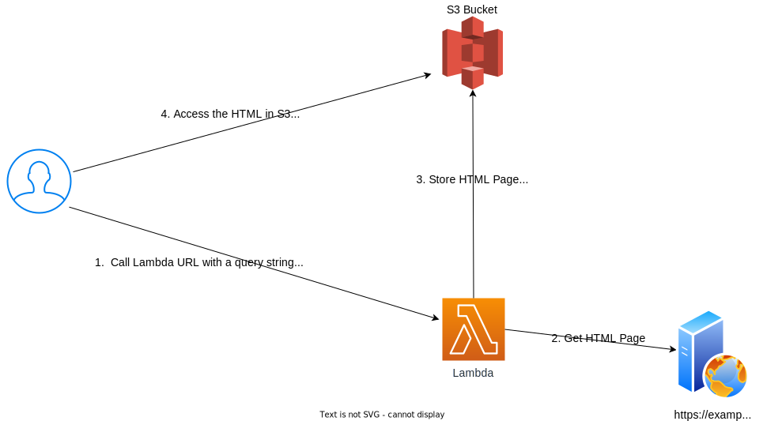

# AWS Lambda Deployment Prototype

This is a prototype to explore different ways to deploy an AWS Lambda function written in Node.js with TypeScript.  
The three deployment options are through terraform, using lambda-build, and using a GitHub action.  

Table of Contents
- [Build and verify the Infrastructure](#build-and-verify-the-infrastructure)
    - [Terraform](#terraform)
    - [Setup Prerequisites to Run the Terraform](#setup-prerequisites-to-run-the-terraform)
    - [Steps to Build the Infrastructure with Terraform](#steps-to-build-the-infrastructure-with-terraform) 
- [Lambda Deployment Options](#lambda-deployment-options)
    - [Deploy the Lambda function using Terraform](#deploy-the-lambda-function-using-terraform)
    - [Deploy the Lambda function using lambda-build](#deploy-the-lambda-function-using-lambda-build)
    - [Deploy the Lambda function using a GitHub action](#deploy-the-lambda-function-using-a-github-action)
- [The Lambda Function](#the-lambda-function)
    - [Run the Lambda Unit Tests](#run-the-lambda-unit-tests)
    - [Deploy Multiple Versions of the Lambda function](#deploy-multiple-versions)


 


## Build and verify the Infrastructure

 Terraform is used to build the infrastructure and deploy the first version of the Lambda function.  

This describes what the Terraform does and how to run the Terraform to build the infrastructure.

### Terraform

The Terraform creates:
- A [Lambda function](#the-lambda-function) called `lambda-url-to-html` that 
    - Has permission to write to the S3 bucket
    - Has a timeout of 20 seconds
    - Is packaged in `./src/deploy/latest.zip` so Terraform can deploy
- Two lambda aliases called live and test.  Each alias with each have a different public function urls to access the function
- A S3 bucket called `storage-for-lambda-url-to-html`.  The S3 bucket permissions allow the lambda to write to it also also public read access to all objects in the bucket
- The `./scripts/variables.sh` file.  The file contains the variables used by the shell scripts

### Setup Prerequisites to Run the Terraform

- An AWS account 

I recommended you use the [Visual Studio Code DevContainer](https://code.visualstudio.com/docs/devcontainers/containers) at the root of this repository.  The instructions below assume you are using the DevContainer.  If you don use the DevContainer you will need to install the following:

- AWS CLI installed and configure for your account
- Terraform 5.0 or greater installed
- Node.js 20.10.0 or greater installed


### Steps to Build the Infrastructure with Terraform

By default the Terraform will create the infrastructure in the us-east-1 region.  To use a different region, edit the variable.tf file and change the region variable.

1. Configure the AWS CLI
    ``` bash
    $ aws configure
    AWS Access Key ID [None]: <your access key>
    AWS Secret Access Key [None]: <your secret key>
    Default region name [None]: us-east-1
    Default output format [None]: json
    ```
2. Run the Terraform to create the infrastructure.
    ``` bash
    $ terraform init
    $ terraform apply
    ```
3. Run the `scripts/test-live.zsh` script to test the live alias.  The script will run the lambda function using the live alias.  The live alias is configured to use the latest version of the lambda function.  
    ``` bash
    $ cd ./scripts
    $ ./test_live.zsh
   Success! Response matches the expected value
    Here is the response: {"title":"Hacker News","s3_url":"https://storage-for-lambda-url-to-html.s3.amazonaws.com/hackernews.html"}
    Success! Response matches the expected value
    Here is the response: {"title":"Hacker News","s3_url":"https://storage-for-lambda-url-to-html.s3.amazonaws.com/undefined.html"}
    ```
    
3. Open the link to the S3 bucket in the browser to see the HTML file that was created by the lambda function.
    Go to  `https://storage-for-lambda-url-to-html.s3.amazonaws.com/hackernews.html` in a browser

You are done.

## Lambda Deployment Options

The next sections explain how to deploy the Lambda function using different methods.  You only need to do one of the deployment options.


### Deploy the Lambda function using Terraform

These steps explain how to create a package that is used by Terraform to deploy the Lambda
function.

1. Run a shell script to package the lambda function 
The script will create a new latest.zip file in the src/deploy directory.  This is the zip file used by Terraform when it deploys the lambda function.
    ``` bash
    $ cd ./scripts
    $./package-latest.zsh 
    added 266 packages, and audited 267 packages in 2s

    36 packages are looking for funding
    run `npm fund` for details

    found 0 vulnerabilities

    > lambda-url-to-html@1.0.0 build
    > lambda-build archive -e index.ts
    ⚡️ Bundling index.ts
    ✔ Created archive.zip 2.39 MB

    Success! You can find the latest lambda package in ../src/deploy/latest.zip 
    ```

2. When you deploy again using Terraform, it will use the latest.zip file in the src/deploy directory to deploy the lambda function.  

### Deploy the Lambda function using lambda-build 

These steps explain how to use lambda-build to deploy the Lambda to AWS

1. If your Lambda function is not in us-east-1 change the region in package.json
   In your editor go to the src folder and open package.json.  Change the the us-east-1 to the region of your lambda function.  
    ``` json
     "deploy": "lambda-build upload -r us-east-1 lambda-url-to-html",
    ``` 
2. Run `npm install` to install the dependencies
    ``` bash
    $ cd ./src
    $ npm install
    added 266 packages, and audited 267 packages in 1s

    36 packages are looking for funding
    run `npm fund` for details

    found 0 vulnerabilities
    ```
3. Deploy the function to AWS
    ``` bash
    $ npm run deploy

    > lambda-url-to-html@1.0.0 deploy
    > lambda-build upload -r us-east-1 lambda-url-to-html


 ⚡️ Bundling & Uploading ./index.js|ts
  → Bundle archived 2.39 MB
  → Using region us-east-1
  → Uploading lambda-url-to-html
  ✔ Successfully uploaded lambda-url-to-html
  ✔ Successfully uploaded 1 function(s)
    ```

Success! You have built and uploaded your Lambda function to AWS.

### Deploy the Lambda function using a GitHub action

These steps explain how to use a GitHub action. With GitHub actions whenever you have any changes to th e src directory a GitHub action can be triggered.  The GitHub action will build and to deploy the Lambda. The GitHub action will 
- Build the Lambda function.
- Run the unit tests
- Deploy the Lambda function to AWS

1. Open GitHub
2. Go to the Settings page for your Repo
3. Under Secrets and Variables create two Secrets called AWS_ACCESS_KEY_ID with the value of your AWS access key and AWS_SECRET_ACCESS_KEY with the value of your AWS secret key

4. Make a directory called .github/workflows at the root of your repository
5. Copy the github/workflows/deploy.yml to the .github/workflows directory
6. Make a change to any file in the src directory and check it in.  

The GitHub action will run and deploy the Lambda function to AWS.  You can see the results of the GitHub action by going to the Actions tab in GitHub.


## The Lambda Function


The Lambda function gets the HTML from a URL that you specify. It will store it in a file in a S3 bucket. It will return a URL to the location on the S3 bucket where the HTML is stored.




1. You call the Lambda function with a url and in the query string you pass it a url for the web site you want to get the HTML and the name for the file to store in the S3 bucket.
2. The Lambda function gets the HTML page and store it in the S3 bucket.
3. The Lambda function returns the URL to the location on the S3 bucket where the HTML is stored
4. You call the URL to get the HTML page from the S3 bucket 

The Lambda function code and unit test focus came from this [YouTube video](https://www.youtube.com/watch?v=51EAwBDdgio). The video is a great introduction to Lambda development, testing, and deployment using Node and TypeScript.  I highly recommend it.

### Run the Lambda Unit Tests

You can run the Unit tests locally. The unit tests are written in Mocha, and use [Sinonjs](https://sinonjs.org/) to stub the calls, and [Node assert](https://nodejs.org/api/assert.html) for comparison.   

To run the tests, run the following command from the `src` directory.

``` bash
$ npm run test
> lambda-url-to-html@1.0.0 test
> mocha --recursive 'test' --extension ts --exit --require esbuild-register --timeout 20000


  handler
    ✔ should get the html from a url
    ✔ should extract and return the page title of a url


  2 passing (11ms)

npm notice 
npm notice New minor version of npm available! 10.2.4 -> 10.4.0
npm notice Changelog: https://github.com/npm/cli/releases/tag/v10.4.0
npm notice Run npm install -g npm@10.4.0 to update!
npm notice 
```


### Deploy Multiple Versions

The Terraform creates two Lambda aliases.  They are:
- live:  The live alias is configured to use the "live" or production version of the Lambda function. 
- latest: The latest alias is configured to use the latest version of the Lambda function. 

These steps show how to to deploy multiple versions of a lambda function and with different endpoints.  One endpoint, the live alias, will reference the previous versions of the lambda, and the latest alias, will point to the current recent release. 


Steps:

1. Create a version of the Lambda function and point the live alias to it.
    ``` bash
    $  ./scripts/make-latest-live.zsh
    {
    "AliasArn": "arn:aws:lambda:us-east-1:588459062833:function:lambda-url-to-html:latest",
    "Name": "latest",
    "FunctionVersion": "9",
    "Description": "",
    "RevisionId": "3ee71710-cb1a-4dee-83d7-4b6685fc33c8"
    }
   
    ```
    Now the live alias points to the version 9 of the Lambda function.  Your version might be different.

2. Run the `scripts/test-live.zsh` script to test the live alias.  
   All tests will pass.

3. Modify the Lambda source 
   Open the `src/index.ts` file and uncomment out this line to enforce validation of the query string parameters
    ```
    /* Uncomment for validation 
    if (!body.name || !body.url) {
        throw Error(`name and url are required`);
    }
    */  
    ``` 
   Save the file   
4. Deploy the new Lambda function code
    ``` bash
    $ cd src
    $ npm run deploy
    ```

5. Run the `scripts/test-live.zsh` again.
    All tests will pass.  Why?  The  script that you ran in Step 1 created a version of the latest Lambda function and pointed the live alias to it.  The live alias still points to that version.  To fix it make a new version of the Lambda function from $latest and point the live alias to it.
6. Run the script to create a new version of the Lambda     function
    ``` bash
    $  ./scripts/make-latest-live.zsh
    {
    "AliasArn": "arn:aws:lambda:us-east-1:588459062833:function:lambda-url-to-html:live",
    "Name": "live",
    "FunctionVersion": "10",
    "Description": "",
    "RevisionId": "0a794987-56f7-4d2c-ad91-864fd40c8044"
    } 
    ```
    Now the live alias points to the version 10 of the Lambda function.
6. Run the `scripts/test-live.zsh` again.
    It fails.  Why? You pointed the live alias to the version you just deployed. That has the validation code.  Validation is good.  So you need to fix the test. This is done in the next script.
7. Run the `scripts/test-live-new.zsh` 
    The test pass.  These tests include a name for the file in the query string so the validation checks pass.


