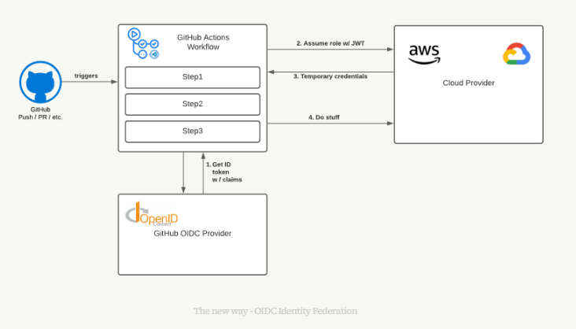

# GitHub Action Authentication to AWS

GitHub actions is a popular and powerful CI/CD tool that can be used to automate workflows. It can be used to deploy applications to AWS. To do this, GitHub actions need to authenticate to AWS. This document describes how to authenticate GitHub actions to AWS.

You can authenticate GitHub Actions to AWS using the following methods:
- IAM user access keys
- IAM roles with temporary credentials

IAM Users are generally reserved for living, breathing human beings, whereas we prefer to use IAM Roles for machines and applications. IAM Users can have web console access and MFA tokens. These are not qualities we generally associate with build jobs

## GitHub OIDC Identity Federation

With OpendID Connect (OIDC) support for GitHub Actions we can securely deploy to any cloud provider that support OIDC using short-lived keys that are automatically rotated for each deployment. 



Steps (High-Level)
1) GitHub Action is triggered
2) GitHub Action authenticates to AWS using OIDC provider
    - Get ID token with OIDC provider
    - Assume role with JWT to AWS STS
    - Get temporary credentials
4) GitHub action uses temporary credentials to deploy to AWS


Steps (Detailed)
1) Create an OIDC provider for GitHub (see github-oidc.tf)
2) Create an IAM role with scope the trust policy (see github-oidc.tf)
    The IAM roles must be scoped to limit access to the resources that the GitHub Actions need to access. Scope to Organization.  
    ```
    "StringEquals": {
    "token.actions.githubusercontent.com:sub": "repo:github_organization/repository_name:ref:refs/heads/branch_name"
    }
    ```

    Scope to Personal Repository
    ```
    "StringEquals": {
    "token.actions.githubusercontent.com:sub": "repo:github_username/repository_name:ref:refs/heads/branch_name"
    }
    ```
3. Update your GitHub Actions workflow to use the OIDC provider to authenticate to AWS. See this [documentation](https://github.com/aws-actions/configure-aws-credentials).


## References

- [Use IAM roles to connect GitHub Actions to actions in AWS](https://aws.amazon.com/blogs/security/use-iam-roles-to-connect-github-actions-to-actions-in-aws/)

- [Configuring OpenID Connect in Amazon Web Services](https://docs.github.com/en/actions/deployment/security-hardening-your-deployments/configuring-openid-connect-in-amazon-web-services)

- [GitHub Actions on AWS](https://scalesec.com/blog/oidc-for-github-actions-on-aws/)
